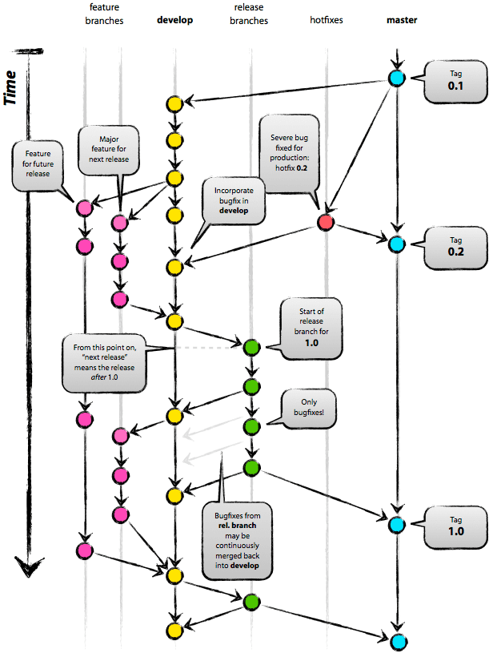
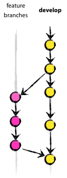

# Схема работы с Git-flow

## Коротко о семантическом версионировании:

У нас есть три цифры, описывающие версию проекта. Например, 1.2.1.

   - <mark>1</mark>.2.1 - Первая цифра говорит о МАЖОРНОЙ версии. МАЖОРНУЮ версию повышаем когда внесенные изменения не совместимы с придыдущей версией продукта.
   - 1.<mark>2</mark>.1 - Вторая — о МИНОРНОЙ версии. Повышаем когда добавили какую то новую функциональность.
   - 1.2.<mark>1</mark> - Третья говорит о ПАТЧ версии. Повышаем при сделанном исправлении.

## Далее, я попробую объяснить это на примере с Git-flow

Вот страшная картинка:

## Git-flow

Обычно у нас есть две основные ветки: `master` и `develop`. Мы все знаем для чего они нужны и что с ними делать (грубо говоря, `master` собирается для клиента (или продакшена), `develop` — для разработчиков). Для каких-либо изменений (как фиксы, так и введение нового функционала) мы создаем отдельные ветки и вливаем их в `develop`.

По Git-flow рабочий проект выглядит иначе:

   - Ветка `develop`
   - Ветки `feature/*`
   - Ветка `master`
   - Ветки `release/*`
   - Ветки `hotfix/*`

## 1.0 Feature-ветки

Итак, у нас есть основная для разработки ветка `develop`. Из неё будут создаваться все `feature/*` ветки — ветки, созданные для добавления функционала.

Например, у нас есть задача сделать первую версию сайта с `header`, `main` и `footer`, где будет только основная информация о скором открытии (допустим) магазина. Мы создаем из `develop` три feature-ветки, а именно:

   - ветка для работы над шапкой сайта `feature/header-layout`
   - ветка для работы над контентом сайта `feature/main-layout`
   - ветка для работы над подвалом сайта `feature/footer-layout`

### 1.1 Создаем `feature-ветку`, прописывая:

    git flow feature start header-layout

Альтернатива на чистом Git:

    git checkout -b feature/header-layout develop

### 1.2 Если нужно обновить текущую ветку новой фичи из другой ветки, которая, например, делается коллегой, то прописываем:

    git flow feature pull origin main-layout

Альтернатива на чистом Git:

    git checkout feature/main-layout
    git pull origin feature/main-layout

Так мы заберем последние изменения в `feature/main-layout`, для того, чтобы не было конфликтов в дальнейшем.

### 1.3 Теперь надо обновить свою ветку фичи из той, которую мы забрали:

    git checkout feature/header-layout
    git merge --no-ff feature/main-layout

Флаг `--no-ff` вынуждает Git всегда создавать новый объект коммита при слиянии, даже если слияние может быть осуществлено алгоритмом fast-forward. Это позволяет не терять информацию о том, что ветка существовала, и группирует вместе все внесённые изменения. Сравните:

### 1.4 Когда хедер сделан, отправляем его с помощью команды

    git flow feature publish header-layout

Альтернатива на чистом Git:

    git checkout feature/header-layout
    git push origin feature/header-layout

## 2.0 Release-ветки

Все три ветки (`feature/header-layout`; `feature/main-layout`; `feature/footer-layout`) находятся в `develop` и базовый функционал для заказчика готов. Теперь необходимо сделать первый МАЖОРНЫЙ релиз `1.0.0`

### 2.1 Создаем `release` ветку из `develop` и указываем версию релиза командой

    git flow release start v1.0.0

Альтернатива на чистом Git:

    git checkout develop
    git checkout -b release/v1.0.0 develop

### 2.2 Обновляем версию проекта в `CHANGELOG.md`, `version.py` и `package.json`. Комментим.

### 2.3 Далее сразу же публикуем её

    git flow release publish v1.0.0

Альтернатива на чистом Git:

    git checkout release/v1.0.0
    git push origin release/v1.0.0

### 2.4 Когда работа над релизом окончена, отправляем его командой

    git flow release finish v1.0.0

Альтернатива на чистом Git:

    git checkout master
    git merge --no-ff release/v1.0.0
    git tag -a v1.0.0
    git checkout develop
    git merge --no-ff release/v1.0.0
    git branch -d release/v1.0.0

Данная команда отправит изменения из `release/v1.0.0` в `master`, а потом в `develop` (также ветке `master` она присвоит тэг `v1.0.0`)

### 2.5 У нас локально обновлены ветки `master` и `develop`. Теперь отправляем их в удаленный репозиторий. Пишем:

    git checkout develop
    git push origin develop
    git checkout master
    git push origin master

И не забываем про тег, который у нас есть пока ещё только локально:

    git push origin v1.0.0

## 3.0 Hotfix-ветки

Итак, релизная версия готова. Но оказалось, что в текущей ветке `master` есть 2 бага. Тут нам понадобятся ветки `hotfix/*`

### 3.1 Чтобы поправить первый баг создаем ветку:

    git flow hotfix start v1.0.1

Альтернатива на чистом Git:

    git checkout master
    git checkout -b hotfix/v1.0.1

### 3.2 Когда баг будет исправлен, делаем коммит и отправляем PR:

    git flow hotfix publish v1.0.1

Нe забываем во время исправлений обновить версию проекта в `CHANGELOG.md`, `version.py` и `package.json`

### 3.3 Теперь кодревьювер должен проверить PR и если все ок, то поставить PR'у approved. Если есть замечания, то исправляем их и делаем снова:

    git flow hotfix publish v1.0.1

### 3.4 Итак, теперь пора закрывать hotfix

    git flow hotfix finish v1.0.1

Альтернатива на чистом Git:

    git checkout master
    git merge --no-ff hotfix/v1.0.1
    git tag -a v1.0.1
    git checkout develop
    git merge --no-ff hotfix/v1.0.1
    git branch -d hotfix/v1.0.1

Исправления `hotfix/v1.0.1` вливаются в локальные ветки `master` и `develop`. Создан тег `1.0.1`.

### 3.5 У нас локально обновлены ветки `master` и `develop`. Теперь отправляем их в удаленный репозиторий. Пишем:

    git checkout develop
    git push origin develop
    git checkout master
    git push origin master

И не забываем про тег, который у нас есть пока ещё только локально:

    git push origin v1.0.1

### 3.6 Ну у нас остался ещё один баг. Создаем снова `hotfix` ветку, но на этот раз она будет иметь другую версию:

    git flow hotfix start v1.0.2

Альтернатива на чистом Git:

    git checkout -b hotfix/v1.0.2 master

### 3.7 Далее — делаем всё то же самое, что и с багом 1.0.1.

## 4.0 Повышаем МИНОРНОСТЬ версии

Отлично! Теперь наша финальная версия имеет номер `v1.0.2`, однако появилась необходимость добавить новую функциональность в данную версию! Заказчик хочет добавить форму заявки.

### 4.1 Создаем новую `feature` ветку из `develop`

    git flow feature start contact-form-layout

Альтернатива на чистом Git:

    git checkout -b feature/contact-form-layout develop

### 4.2 Делаем в ней необходимые изменения, после отправляем

    git flow feature publish contact-form-layout

Альтернатива на чистом Git:

    git checkout feature/contact-form-layout
    git push origin contact-form-layout

### 4.3 Далее — создаем новый МИНОРНЫЙ релиз `1.1.0`:

    git flow release start v1.1.0

Альтернатива на чистом Git:

    git checkout -b release/v1.1.0 develop

### 4.4 Публикуем (отправляем на гитхаб эту ветку)

    git flow release publish v1.1.0

Альтернатива на чистом Git:

    git checkout release/v1.1.0
    git push origin release/v1.1.0

### 4.5 Отправляем его в `master` и в `develop`

    git flow release finish 1.1.0

Альтернатива на чистом Git:

    git checkout master
    git merge --no-ff release/v1.1.0
    git tag -a v1.1.0
    git checkout develop
    git merge --no-ff release/v1.1.0
    git branch -d release/v1.1.0

Теперь в `master` и в `develop` новая версия `1.1.0`
